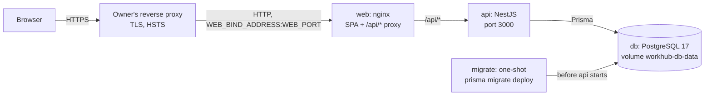
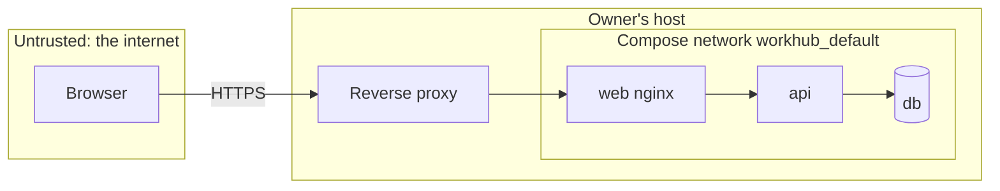

# Architecture

> The system overview: the parts of WorkHub, how a request reaches the database,
> what runs where and whom each part trusts, and the scale it is built for. The
> detail lives in the canonical documents this page links to —
> [BACKEND_ARCHITECTURE.md](BACKEND_ARCHITECTURE.md),
> [FRONTEND_ARCHITECTURE.md](FRONTEND_ARCHITECTURE.md),
> [SECURITY_STANDARDS.md](SECURITY_STANDARDS.md) and
> [OPERATIONS.md](OPERATIONS.md). The product decisions behind it are in
> [PRODUCT.md](PRODUCT.md) and ADR-0019.

## Overview

WorkHub is a **monorepo** holding a single-page web client and a REST API backed
by PostgreSQL. It ships as two container images, `web` and `api`, and runs as one
Docker Compose stack on the owner's server behind the owner's reverse proxy.

- **One origin.** nginx in the `web` container serves the static bundle and
  proxies `/api/*` (the API and Better Auth's `/api/auth/*`) to the `api`
  service. The bundle calls relative `/api` paths, so it contains no
  environment-specific URL, auth cookies stay first-party, and there is no CORS
  in production.
- **Migrations before traffic.** `migrate` runs from the `api` image, applies
  pending Prisma migrations and exits; compose starts `api` only if it exits 0.

## Components

| Part                | What it is                                                                                                                      | Canonical document                                   |
| ------------------- | ------------------------------------------------------------------------------------------------------------------------------- | ---------------------------------------------------- |
| `apps/web`          | React 19 SPA built by Vite; Tailwind CSS v4 and shadcn/ui; served by nginx in production                                        | [FRONTEND_ARCHITECTURE.md](FRONTEND_ARCHITECTURE.md) |
| `apps/api`          | NestJS 11 modular monolith (ADR-0008): controllers → services → Prisma; Better Auth for sessions; a CLI for accounts (ADR-0018) | [BACKEND_ARCHITECTURE.md](BACKEND_ARCHITECTURE.md)   |
| `packages/types`    | The shared contract (ADR-0017): envelopes, types generated from the committed OpenAPI document, rules both apps enforce         | [API.md](API.md)                                     |
| `packages/config`   | Shared ESLint and tsconfig presets                                                                                              | [DEVELOPMENT.md](DEVELOPMENT.md)                     |
| PostgreSQL + Prisma | One database; `apps/api/prisma/schema.prisma` is the source of truth; migrations are committed and forward-only                 | [DATABASE.md](DATABASE.md)                           |

## Boundaries

- **The web app never imports from the API, and vice versa.** Shapes and rules
  that cross the boundary go through `@repo/types`; the committed OpenAPI
  contract is checked for drift in CI (ADR-0017).
- **Dependencies point inward:** controllers depend on services, services on
  persistence; nothing depends on controllers.
- **No business logic in controllers or React components.**
- **All external input is validated at the boundary**, and every domain row is
  checked for ownership in the service (ADR-0016,
  [SECURITY_STANDARDS.md](SECURITY_STANDARDS.md)).

- **Tools and core (ADR-0020).** WorkHub is one app made of tools, such as
  Hours. A tool is a compile-time grouping — an API module group, a web feature
  folder, a sidebar entry and routes under `/<tool>` — with no plugin runtime.
  Records more than one tool needs live in a shared **core**. Tools may use
  core; core never uses a tool, and tools never use each other
  ([BACKEND_ARCHITECTURE.md](BACKEND_ARCHITECTURE.md#tools-and-core-adr-0020),
  [FRONTEND_ARCHITECTURE.md](FRONTEND_ARCHITECTURE.md#tools-and-the-sidebar-adr-0020)).

The request lifecycle inside the API — guards, pipes, interceptors, the
exception filter — is in
[BACKEND_ARCHITECTURE.md](BACKEND_ARCHITECTURE.md#request-lifecycle).

## Runtime topology

As defined by [`docker-compose.prod.yml`](../docker-compose.prod.yml):

| Service   | Published?                                                                                             | Talks to   | State                                             |
| --------- | ------------------------------------------------------------------------------------------------------ | ---------- | ------------------------------------------------- |
| `web`     | **The only published port:** `${WEB_BIND_ADDRESS}:${WEB_PORT}` → 8080, bound to `127.0.0.1` by default | `api:3000` | None                                              |
| `api`     | No — reachable only on the compose network                                                             | `db:5432`  | None (in-memory rate-limit counters)              |
| `migrate` | No — runs once per `up`                                                                                | `db:5432`  | None                                              |
| `db`      | No host port                                                                                           | —          | **`workhub-db-data`** — the one volume to back up |

- **One stateful volume.** Everything else is rebuilt from the images, the
  compose file and `.env.production`. The volume name is pinned so it doesn't
  depend on the compose project name; backups and restore are in
  [OPERATIONS.md](OPERATIONS.md#backups-and-restore).
- **Health.** `api` exposes `/health` (liveness, used by its Docker healthcheck)
  and `/health/ready` (database ping) at the root, outside `/api`; nginx proxies
  both exact paths, so an external monitor can reach readiness
  ([OBSERVABILITY.md](OBSERVABILITY.md#health)).
- **Images** are published to GHCR per release and pinned by `IMAGE_TAG`
  ([RELEASING.md](RELEASING.md)).

### Trust boundaries

- **Public:** whatever the reverse proxy serves for `APP_ORIGIN` — the SPA, the
  API under `/api/v1/*` (deny by default, apart from the `@Public()` inventory
  in [SECURITY_STANDARDS.md](SECURITY_STANDARDS.md#authentication)) and Better
  Auth under `/api/auth/*`. TLS ends at the proxy.
- **Internal:** the API port, the database and the Docker networks. Docker's
  published ports bypass host firewalls, so the web port binds to `127.0.0.1`
  unless `WEB_BIND_ADDRESS` deliberately widens it.
- **Proxy trust.** The API honours `X-Forwarded-For` only from the hops listed in
  `AUTH_TRUSTED_PROXIES` (default `172.16.0.0/12`, the Docker networks): the same
  list sets Express's `trust proxy` and Better Auth's trusted proxies, so rate
  limits apply per client and a client cannot choose its own IP
  ([SECURITY_STANDARDS.md](SECURITY_STANDARDS.md#proxy-trust)). A proxy outside
  that range must be added ([OPERATIONS.md](OPERATIONS.md#reverse-proxy)).
- **Origins.** In production `APP_ORIGIN` is the only trusted origin for CORS and
  Better Auth's origin check.
- **Secrets** reach the containers only through `.env.production` on the host;
  none are baked into images ([SECURITY_STANDARDS.md](SECURITY_STANDARDS.md#secrets)).
- **Not yet exposure-ready.** Passkeys, a session policy, a per-account
  brute-force posture, auth security events and automated backups must exist
  before the first public deployment
  ([OPERATIONS.md](OPERATIONS.md#before-exposing-it-to-the-internet)).

## Scale assumptions

- **One owner, one API instance, one database** (PRODUCT.md → Scale). Horizontal
  scaling and multiple API instances are non-goals.
- **In-process state is acceptable:** both rate limiters (Better Auth's and the
  Nest throttler) keep their counters in memory, and restarting `api` resets
  them. A second instance would need a shared store — a new ADR.
- **Brief downtime on deploy is accepted.** Containers restart during an upgrade,
  so migrations need not stay compatible with the previous image
  ([DATABASE.md](DATABASE.md#migrations)).
- **No worker, cache or object store.** When a feature first needs one, the
  defaults in PRODUCT.md → Deferred infrastructure apply.
- **Performance** is measured on this shape, not hypothetical load
  ([PERFORMANCE.md](PERFORMANCE.md)).

## Configuration

- All configuration comes from environment variables, validated with Zod at
  start-up; the API refuses to boot on invalid configuration
  ([BACKEND_ARCHITECTURE.md](BACKEND_ARCHITECTURE.md#configuration)). The
  variables are listed in [`.env.example`](../.env.example).
- Nothing environment-specific is hard-coded or built into the images, so a
  released image runs unchanged wherever it is deployed.

## Observability

Pino JSON logs with correlation IDs and the two health endpoints; OpenTelemetry
is deferred (ADR-0019). Rules: [OBSERVABILITY.md](OBSERVABILITY.md); reading
logs and setting up alerts: [OPERATIONS.md](OPERATIONS.md#logs).

## Cross-cutting principles

- **Type-safety end to end** — shared types, strict TypeScript, validated DTOs.
- **Fail fast, degrade gracefully** — refuse bad configuration at start-up;
  handle errors without leaking internals.
- **Reproducible** — pinned toolchain, lockfile and immutable images.
