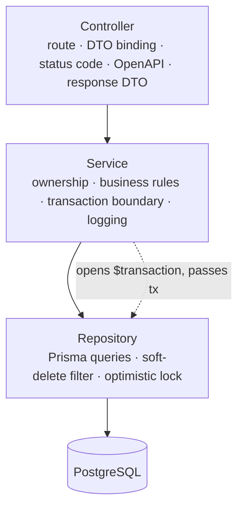
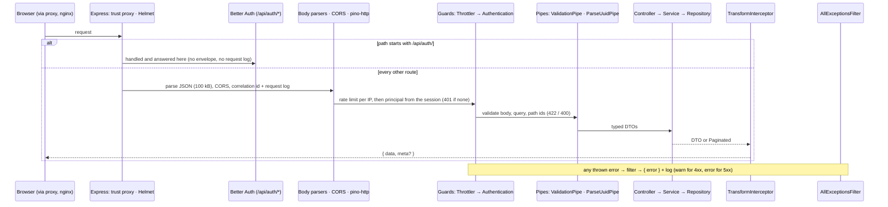

# Backend architecture

> How the API (`apps/api`) is put together: modules and layers, dependency
> injection, the request lifecycle, configuration, errors, and where
> transactions, time and deferred infrastructure fit. Backed by ADR-0008
> (modular monolith), ADR-0014/0015 (the reference template) and ADR-0017
> (shared contracts). The rules themselves live in their canonical documents:
> [API.md](API.md), [DATABASE.md](DATABASE.md),
> [SECURITY_STANDARDS.md](SECURITY_STANDARDS.md),
> [OBSERVABILITY.md](OBSERVABILITY.md) and [TESTING.md](TESTING.md).

## Shape

A **NestJS 11 modular monolith** on Express 5, run as **one instance** in Docker
Compose next to PostgreSQL (ADR-0019). There is no worker, cache or object store.
Features are generated from the reference template (`pnpm gen:feature`,
[REFERENCE_FEATURE.md](REFERENCE_FEATURE.md)); none exist yet.

```text
apps/api/src/
├── main.ts                 # bootstrap: Pino logger, configureApp, Swagger (non-prod), shutdown hooks, listen
├── app.setup.ts            # HTTP wiring shared with e2e tests: trust proxy, Helmet, Better Auth, body parsing, CORS, prefix, versioning
├── app.module.ts           # root module: global logger, throttler, pipe, interceptor, filter, guards
├── config/                 # Zod env schema, .env path, typed AppConfigService
├── prisma/                 # PrismaService — the database client
├── common/
│   ├── auth/               # Better Auth instance, AuthContextService (the auth seam), Principal
│   ├── guards/             # AuthenticationGuard (deny by default)
│   ├── decorators/         # @Public(), @CurrentUser()
│   ├── filters/            # AllExceptionsFilter → { error } envelope
│   ├── interceptors/       # TransformInterceptor → { data, meta } envelope
│   ├── errors/             # domain errors: NotFound, Conflict, Forbidden, Validation
│   ├── dto/                # PaginationQueryDto, Paginated
│   ├── openapi/            # ApiDataResponse / ApiPaginatedResponse, document builder
│   └── validation/         # ParseUuidPipe (accepts UUID v7)
├── health/                 # /health, /health/ready (Terminus)
├── me/                     # GET /api/v1/me
├── public-config/          # GET /api/v1/config
├── cli/                    # user create / reset-password, db seed (no HTTP server)
├── generate-openapi.ts     # writes openapi.json for pnpm contract:generate
└── modules/<feature>/      # generated features (none yet)
```

## Layers



- **Controller** — thin: binds validated DTOs, injects the principal with
  `@CurrentUser()`, calls one service method, maps the entity to a response DTO.
  No business logic, no Prisma.
- **Service** — authorises (`principal.owns(row)`), applies rules, owns the
  transaction boundary, logs, and throws **domain errors** — never HTTP
  exceptions.
- **Repository** — the only Prisma consumer. Every read goes through the
  soft-delete filter.
- **Dependencies point inward** (controller → service → repository). A feature
  never imports another feature's internals; it uses that module's exported
  service. Cross-cutting code lives in `common/`; cross-app contracts in
  `@repo/types`.

## Dependency injection

- Constructor injection throughout; providers are stateless singletons.
- **Seams exist only where they earn their keep.** Today there is one:
  `AuthContextService`, which resolves the principal from Better Auth and which
  e2e tests override to act as a user. Add a seam when a second implementation
  or a test needs one — not in advance:
  - a `Clock` provider **(planned)** for code whose rules depend on "now"
    ([DATABASE.md](DATABASE.md#time));
  - a storage service over the backed-up volume, when a feature first stores
    files (ADR-0019).
- Better Auth is built by a factory (`createAuth`) and injected by the
  `AUTH_INSTANCE` token; `AuthModule` and `AppConfigModule` are global.

## Request lifecycle

Order matters, because Express middleware registered in `configureApp` runs
before anything Nest registers at `app.init()`:



## Configuration

- **Zod schema** in `config/env.validation.ts` is the single definition of every
  variable, its default and its production rules (for example
  `BETTER_AUTH_SECRET` ≥ 32 characters and no placeholder). `ConfigModule`
  validates at startup and the app refuses to boot on bad configuration.
- **Typed access** through `AppConfigService`. Product code never reads
  `process.env`; the exceptions are entry points that set defaults before the
  module graph loads (`cli/bootstrap.ts`, `generate-openapi.ts`) and the seed's
  production guard.
- **Where values come from:**
  - `pnpm dev` and tests: the repository-root `.env` (created by
    `scripts/setup.sh`), loaded by `ConfigModule` from `ENV_FILE_PATH`
    (`../../.env`, relative to `apps/api`). A missing file is skipped, and
    variables already in the environment always win.
  - CLI scripts (`pnpm user:*`, `pnpm db:seed`): `node --env-file-if-exists=../../.env`.
  - Containers: the real environment from compose and `.env.production`.
- Adding a variable: the schema, a getter on `AppConfigService`, `.env.example`,
  and the compose files if production needs it.

## Errors

- Services throw the domain errors in `common/errors/domain-errors.ts`;
  `AllExceptionsFilter` maps them, Nest `HttpException`s and known Prisma errors
  (`P2025` → 404, `P2002` → 409, `P2023` → 400) and known body-parser
  rejections (400, 413, 415) to the error envelope. Everything else becomes a generic 500 and is
  logged with its stack.
- Status and code rules are in [API.md](API.md#status-codes).

## Validation

API DTOs use `class-validator` with the global `ValidationPipe`; the
environment, CLI and web use Zod; rules both apps enforce are constants in
`@repo/types`. The rules are in [API.md](API.md#validation-errors) and
[SECURITY_STANDARDS.md](SECURITY_STANDARDS.md#input-validation). The split is
revisited at the NestJS 12 migration, where Standard Schema support could unify
it ([TECH_DEBT.md](TECH_DEBT.md), DECISIONS.md 2026-09-16).

## Transactions and time

- **Transactions:** the service opens `prisma.$transaction` and passes the
  transaction client to repository methods that accept one — the standard for new
  code, defined in [DATABASE.md](DATABASE.md#transactions).
- **Time:** instants in UTC, calendar dates as `date`, local-day rules in
  `Europe/London`, and a planned `Clock` seam — [DATABASE.md](DATABASE.md#time).

## Authentication and authorisation

Better Auth handles `/api/auth/*`; `AuthenticationGuard` protects every other
route unless `@Public()`; services enforce ownership on every row (ADR-0016).
All of it is specified in [SECURITY_STANDARDS.md](SECURITY_STANDARDS.md).

## Logging and health

Pino with correlation IDs, and `/health` / `/health/ready` via Terminus —
[OBSERVABILITY.md](OBSERVABILITY.md). `main.ts` enables shutdown hooks, so on
`docker compose stop` the app closes the HTTP server and the Prisma connection
cleanly.

## API contract

Controllers document the envelope with `ApiDataResponse` /
`ApiPaginatedResponse`; `pnpm contract:generate` builds the app without a
database, writes `apps/api/openapi.json`, and regenerates the web's types in
`@repo/types`. CI fails on drift ([API.md](API.md#openapi-contract-adr-0017)).

## CLI

`cli/user.ts` and `cli/seed.ts` boot the module graph as an application context
(no HTTP server) through `runWithAuthContext` and use Better Auth's own
password hashing (ADR-0018). New operational commands — the planned data export,
passkey recovery — follow the same pattern.

## Deferred infrastructure

Not built, and not drawn above. When a feature first needs one, use the defaults
in ADR-0019 ([PRODUCT.md](PRODUCT.md#deferred-infrastructure)): pg-boss or an
in-process scheduler for background work, no shared cache, a backed-up Docker
volume behind a storage service for files, and OpenTelemetry only when logs stop
being enough. ADR-0009, 0010 and 0011 keep their reasoning (idempotent jobs,
cache invalidation, storage behind an interface); adopting the infrastructure
they name would need a new ADR.
