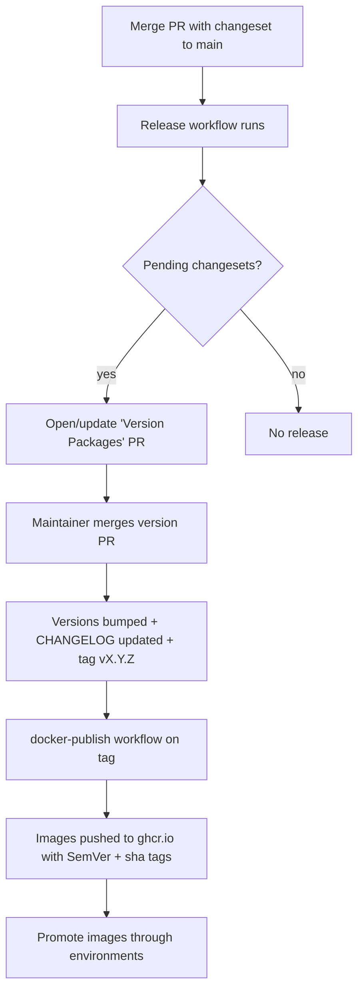
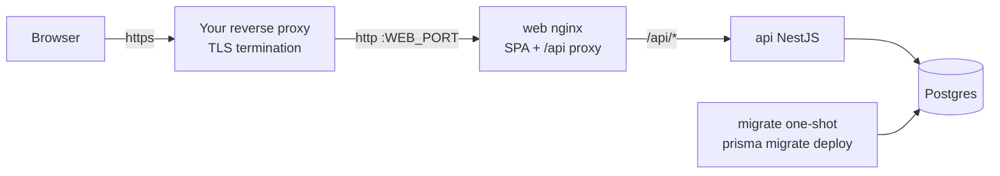

# Deployment & Release

> **Status:** the release pipeline (versioning + image publishing) and the
> self-hosted deployment path (`docker-compose.prod.yml` behind the operator's
> reverse proxy) are defined. This document describes both.

## Release flow (overview)

## Versioning

- **Semantic Versioning**, driven by **Changesets**. Contributors add a
  changeset (`pnpm changeset`) for user-visible changes.
- The [`release`](../.github/workflows/release.yml) workflow maintains a
  "Version Packages" PR. Merging it bumps versions, writes `CHANGELOG.md`
  entries, and creates a `vX.Y.Z` tag.

## Container images

- Built by [`docker-publish.yml`](../.github/workflows/docker-publish.yml) on
  version tags (and manually via `workflow_dispatch`).
- Published to **GitHub Container Registry**:
  - `ghcr.io/huttonhomehub/workhub/api`
  - `ghcr.io/huttonhomehub/workhub/web`
- Tags: full SemVer, `major.minor`, and commit `sha`. Images include an **SBOM**
  and **build provenance**.
- Images are **immutable**: the same artifact is promoted across environments;
  we never rebuild per environment.

## Environments (intended)

| Environment | Purpose                     | Source                            |
| ----------- | --------------------------- | --------------------------------- |
| Local       | Development                 | `docker compose`                  |
| Staging     | Pre-production verification | image tag from `main`/pre-release |
| Production  | Live                        | promoted SemVer-tagged image      |

Configuration and secrets are supplied per-environment via the platform's
secret manager or a server-side env file — never baked into images or
committed. See [`.env.example`](../.env.example) for the required variables.

## Production deployment (self-hosted, behind your reverse proxy)

[`docker-compose.prod.yml`](../docker-compose.prod.yml) is the reference
deployment: pinned GHCR images on a Docker host, with the operator's existing
reverse proxy (Caddy / Traefik / Nginx Proxy Manager / …) in front.

- **One origin, one exposed port.** The web container serves the SPA and
  proxies `/api/*` to the API — no URLs are baked into the bundle, auth
  cookies stay first-party, and CORS is a non-issue in production.
- Postgres is reachable only on the compose network (no host port).
- Required secrets (`POSTGRES_PASSWORD`, `BETTER_AUTH_SECRET`, `APP_ORIGIN`,
  `IMAGE_TAG`) have **no defaults** — compose refuses to start without them.
- Deploy = update `IMAGE_TAG` in `.env.production`, then
  `docker compose -f docker-compose.prod.yml --env-file .env.production pull && … up -d`.
- Your proxy must forward `X-Forwarded-For`/`X-Forwarded-Proto`; both the web
  nginx and the API honour them (`trust proxy`).
- `AUTH_TRUSTED_PROXIES` (default `172.16.0.0/12`, the Docker networks) tells the
  API which `X-Forwarded-For` hops to skip, so auth rate limits apply per client.
  If your reverse proxy runs on a different host, add its address.

## Database migrations

- Applied with `prisma migrate deploy` by the compose `migrate` one-shot
  service (the API image ships the Prisma CLI + migrations); the API starts
  only after it succeeds, so the schema is always current before traffic.
- Migrations are backward-compatible where feasible (expand/contract) so a
  rollout can proceed without downtime and a rollback stays safe.

## Runtime health & rollout

- The API exposes `/health` (liveness/readiness) for the orchestrator.
- Roll out gradually where the platform supports it; watch health and error
  rates. **Rollback = redeploy the previous image tag** (plus any compensating
  migration).

## Pre-release checklist

- [ ] CI green on `main` (lint, typecheck, unit, e2e)
- [ ] CodeQL clean; no unresolved high-severity alerts
- [ ] Changesets present for user-visible changes
- [ ] `CHANGELOG.md` reflects the release
- [ ] Migrations reviewed and reversible/safe
- [ ] Relevant docs updated
