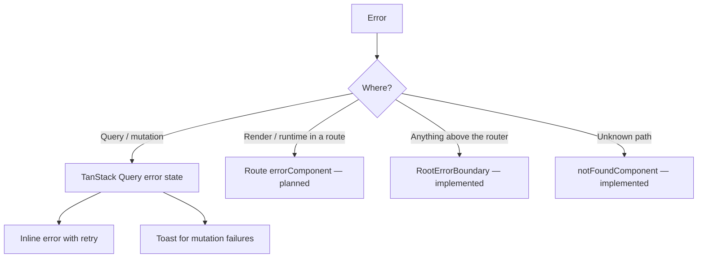
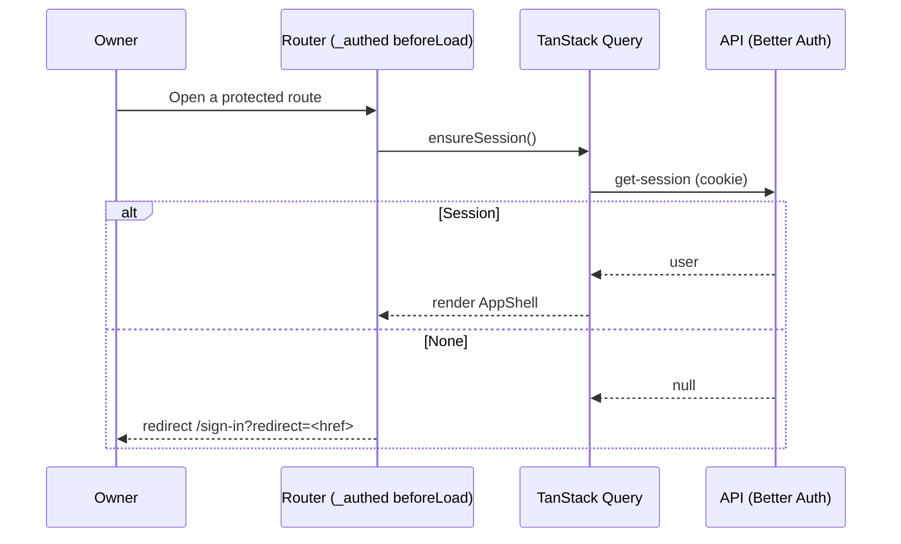

# Frontend Architecture

> How `apps/web` is structured: folders, state, routing, data, forms, errors,
> auth and theming. Backed by ADRs
> [0004](adr/0004-frontend-state-management.md)–[0007](adr/0007-forms-and-validation.md).
> Interaction rules are in [`UX_STANDARDS.md`](UX_STANDARDS.md); tokens in
> [`DESIGN_SYSTEM.md`](DESIGN_SYSTEM.md); budgets in
> [`FRONTEND_QUALITY.md`](FRONTEND_QUALITY.md).

**Status:** a walking skeleton. The entry, providers, router, auth and account
features, the app shell with its tools sidebar, and seven primitives exist.
Anything marked **_planned_** is the agreed pattern for when a feature first
needs it — it is not in the code, so don't cite it as existing.

## Guiding principles

Consistency · Accessibility · Keyboard-completeness · Maintainability ·
Performance · Simplicity · Reuse. Optimise for long-term maintainability over
short-term convenience.

## Technology summary

| Concern      | Choice                                              | ADR  |
| ------------ | --------------------------------------------------- | ---- |
| Framework    | React 19 + TypeScript (Vite)                        | —    |
| Styling      | Tailwind CSS v4 + design tokens + shadcn/ui + CVA   | 0006 |
| Routing      | TanStack Router (file-based, type-safe)             | 0005 |
| Server state | TanStack Query                                      | 0004 |
| Client state | React local state · Context · Zustand (when needed) | 0004 |
| Forms        | React Hook Form + Zod                               | 0007 |
| API client   | `openapi-fetch` typed by the committed contract     | 0017 |
| Icons        | Lucide (`lucide-react`)                             | —    |
| Testing      | Vitest + Testing Library; Playwright + axe (e2e)    | —    |

## Folder structure

Feature-first: code is grouped by what it does for the owner, not by technical
type. This is what exists today, plus the folders a feature adds.

```text
apps/web/
├── index.html                # Pre-paint theme and sidebar-state script
├── e2e/                      # Playwright journeys (auth, app-shell), support.ts, global-setup.ts
└── src/
    ├── main.tsx              # Creates the query client + router, mounts providers
    ├── app/
    │   ├── providers.tsx     # RootErrorBoundary → ThemeProvider → QueryClientProvider
    │   ├── router.tsx        # createRouter: route tree, context, preload defaults
    │   └── tools.ts          # The tool registry: manifests in sidebar order (ADR-0020)
    ├── routes/               # File-based routes (routeTree.gen.ts is generated)
    │   ├── __root.tsx        # Outlet + notFoundComponent
    │   ├── _authed.tsx       # Auth guard layout → AppShell (with app/tools.ts)
    │   ├── _authed/index.tsx # Signed-in home
    │   └── (public)/         # sign-in.tsx, sign-up.tsx
    ├── features/
    │   ├── auth/             # api/ (session, auth-client, auth-config), components/, schemas/
    │   └── account/          # api/me.ts
    │       └── index.ts      # A feature's public surface
    ├── components/
    │   ├── ui/               # Primitives: alert, button, card, form, input, label, tooltip
    │   └── layout/           # app-shell.tsx (TooltipProvider, skip link, header, main), sidebar.tsx
    ├── hooks/                # use-theme.tsx
    ├── lib/
    │   ├── api/client.ts     # apiClient, ApiRequestError, unwrap()
    │   ├── query/client.ts   # createQueryClient() with cache defaults
    │   ├── preferences.ts    # Persisted UI preferences (localStorage)
    │   ├── tool-manifest.ts  # ToolManifest and ToolCommand types
    │   └── utils.ts          # cn()
    ├── styles/globals.css    # Design tokens
    └── test/setup.ts         # Vitest + jest-dom setup
```

A feature grows `components/`, `api/`, `hooks/` and `schemas/` as it needs them,
and exports only through `index.ts`. File names are kebab-case.

There is **no** `config/` folder, `lib/telemetry.ts` or media-query hook. Client
env access and client error reporting will get a home when they are first needed
(FRONTEND_QUALITY.md → Client error reporting).

**Dependency direction:** features → shared (`components`, `hooks`, `lib`), never
the reverse, and never feature → feature — share through a shared layer or
`@repo/types`. The one exception is **`features/core/<entity>`** (ADR-0020 §3):
any tool may import it, and it imports no tool.

## Tools and the sidebar (ADR-0020)

WorkHub is one app made of tools. The web side of a tool is a feature folder
plus a **manifest** that tells the shell about it.

- **`ToolManifest`** (`lib/tool-manifest.ts`) has five fields: `id`, a
  kebab-case tool id (`core` is reserved); `label`, sentence case; `icon`, a
  Lucide icon; `path`, the tool's home route as a typed router path; and
  `commands`, its palette commands (`{ id, label }`, "Go to <tool>" first).
- **A tool exports its manifest** from `features/<tool>/tool.ts`.
- **`app/tools.ts` is the registry:** it lists the manifests in sidebar order.
  `app/` is the composition root, like `routes/`, so it is the one shared place
  that imports features. Home belongs to no tool, so its manifest is declared
  in `app/tools.ts` itself.
- **The sidebar** (`components/layout/sidebar.tsx`) renders one link per
  manifest; `routes/_authed.tsx` passes the registry to `AppShell`. A tool's
  link is `aria-current="page"` on every route under its path, whatever the
  search params.
- The command palette will read the same manifests when it is built.

## Component organisation

Three tiers ([`COMPONENT_LIBRARY.md`](COMPONENT_LIBRARY.md)):

1. **Primitives** (`components/ui/`) — accessible, themeable, no business logic.
   Third-party headless libraries are wrapped here.
2. **Composites and layout** (`components/layout/`, a feature's `components/`).
3. **Routes** (`routes/`) — compose data and composites for a screen.

## State: where each kind lives (ADR-0004)

| State                                               | Home                                                  | Status      |
| --------------------------------------------------- | ----------------------------------------------------- | ----------- |
| Server data                                         | TanStack Query                                        | implemented |
| Filters, sort, selection, open tab/pane/dialog      | Router search params                                  | pattern     |
| Component-local UI                                  | `useState` / `useReducer`                             | implemented |
| Theme                                               | `ThemeProvider` (Context) + `localStorage`            | implemented |
| Command palette open state and its command registry | a small Zustand store (`components/command-palette/`) | _planned_   |
| Sidebar collapsed                                   | `localStorage` via `lib/preferences.ts`               | implemented |
| Pane sizes, table column state                      | `localStorage` via `lib/preferences.ts`               | _planned_   |

### Persisted UI preferences

Sidebar collapsed state, pane sizes and table column widths/visibility/order are
**per-browser preferences in `localStorage`**, not server state and not URL
state. Reasons: one owner, no need to follow them across devices yet, instant on
first paint, and no API surface. Rules:

- One typed helper (`lib/preferences.ts`) owns the keys, a version and a
  Zod-validated read with a default — a corrupt or old value falls back silently.
  `readPreference(name)` and `writePreference(name, value)` store
  `{ "version": 1, "value": … }`; unavailable or full storage never throws. Add a
  preference by adding its name, shape, key and default there.
- Keys are namespaced (`workhub:sidebar`, `workhub:panes:<route>`,
  `workhub:table:<id>`).
- Sidebar state is applied before first paint, like the theme, so the shell does
  not jump: the inline script in `index.html` sets `data-sidebar` on `<html>`,
  `AppShell` keeps it in sync, and the `sidebar-rail:` CSS variant
  (DESIGN_SYSTEM.md → Layout) does the rest. `src/pre-paint-script.test.ts` checks the
  script's key and version against the helper. The script only ever writes
  constants (`'collapsed'` or `'expanded'`) into the DOM, never stored text.
- If the owner later wants preferences to follow them between machines, move them
  to a server `preferences` resource — that is a Feature, not a tweak.

## Routing (ADR-0005)

- **File-based routes** under `routes/`; `_authed.tsx` is the layout that guards
  and renders the shell once.
- **Typed search params** validated with Zod (`sign-in.tsx` does this for
  `redirect`). URL state rules are in
  [UX_STANDARDS.md](UX_STANDARDS.md#url-state).
- **Guards:** `beforeLoad` on `_authed` calls `ensureSession()` and redirects to
  `/sign-in?redirect=<href>`. Public routes use `beforeLoad` to pre-load the
  session and `GET /api/v1/config`.
- **Code splitting:** `autoCodeSplitting: true` in `vite.config.ts` gives each
  route its own chunk.
- **Focus after navigation — implemented:** the root route subscribes
  `lib/route-focus.ts` to the router's `onRendered` event. A navigation that
  changes the pathname moves focus to `<main>` (or the first heading on a page
  without `<main>`). The initial load and search-param-only or hash-only changes
  leave focus where it is, so a control that only rewrites the query (a week
  navigator, a filter) keeps focus. Don't add per-page focus handling for route
  changes ([ACCESSIBILITY.md](ACCESSIBILITY.md), 2.4.3).
- **Router defaults — implemented:** `defaultPreload: 'intent'` (hover/focus warms
  a route), `defaultPreloadStaleTime: 0` (the query cache owns freshness),
  `scrollRestoration: true`, and a root `notFoundComponent`.
- **Router defaults — _planned_:** `defaultPendingComponent` (a shell-shaped
  skeleton), `defaultPendingMs: 300` and `defaultPendingMinMs: 300` so nothing
  flashes, and `defaultErrorComponent` for route-level recovery. Until these land,
  a failing route blanks up to the root boundary.
- **Route loaders — _planned_:** no route defines a `loader` today. When a data
  route lands, its loader calls `queryClient.ensureQueryData(<feature>QueryOptions)`
  so intent preloading also warms the data, and the component reads the same
  options with `useQuery`/`useSuspenseQuery`.

## Data fetching and caching (ADR-0004)

**All server data goes through TanStack Query.** Components never fetch in
`useEffect` or keep server data in `useState`.

- **Query options** live in a feature's `api/` folder, exported as
  `queryOptions(...)` plus a hook (`features/account/api/me.ts`), so routes and
  components share one definition.
- **Query keys** use a per-feature factory:

  ```ts
  export const itemKeys = {
    all: ['items'] as const,
    lists: () => [...itemKeys.all, 'list'] as const,
    list: (filters: ItemFilters) => [...itemKeys.lists(), filters] as const,
    detail: (id: string) => [...itemKeys.all, 'detail', id] as const,
  };
  ```

- **Defaults** (`lib/query/client.ts`, implemented): `staleTime` 30s, `gcTime`
  5 minutes, `refetchOnWindowFocus: true` (keeps a background tab fresh — see
  [UX_STANDARDS.md](UX_STANDARDS.md#multiple-tabs)), retry up to 3 times except
  for responses below 500, and no mutation retries.
- **The API client** (`lib/api/client.ts`, ADR-0017) is `openapi-fetch` typed by
  the generated `paths`: same-origin cookies, non-2xx → `ApiRequestError` with the
  error envelope, and `unwrap()` returns `data`.

### Optimistic updates and undo — _planned pattern_

Reversible deletes act immediately and offer undo (UX_STANDARDS.md → Feedback).
With TanStack Query:

1. `onMutate`: cancel the list query, snapshot it, remove the row from the cache,
   and show the undo toast.
2. The **mutation is the soft delete** (`DELETE` → `deletedAt` set). **Undo** calls
   the entity's `POST /:id/restore` (generated from the reference template) and
   invalidates the list; it does not rely on delaying the
   request, so closing the tab never loses a delete the owner saw happen.
3. `onError`: restore the snapshot and raise an error toast.
4. `onSettled`: invalidate the affected list and detail keys.

Focus moves to the next row after the removal (ACCESSIBILITY.md).

### Lists and virtualisation — _planned_

Lists above ~200 rows are virtualised (FRONTEND_QUALITY.md) with TanStack
Virtual inside the owned `DataTable` primitive. Data is paged or cursored from
the API; the client never fetches an unbounded list to virtualise it.

## Forms (ADR-0007)

React Hook Form + Zod through the shared `Form` primitive
(`components/ui/form.tsx`), with submissions as Query mutations.

- **Implemented:** `FormField`/`FormItem`/`FormLabel`/`FormControl`/`FormMessage`
  wire ids, `aria-describedby` and `aria-invalid`; React Hook Form's default
  `shouldFocusError` moves focus to the first invalid field on submit; server
  errors render in an `Alert` at the top (`sign-in-form.tsx`).
- **_Planned_:** an **error summary** listing each failure as a link to its field
  (ADR-0007 describes one; the primitive does not render it), and a `Button`
  pending state instead of swapping the label.
- **Unsaved-changes guard — _planned_:** an explicit-save form with
  `formState.isDirty` uses TanStack Router's `useBlocker` to confirm in-app
  navigation, with `enableBeforeUnload` for reload and tab close; the block is
  released on successful save. Behaviour is specified in
  [UX_STANDARDS.md](UX_STANDARDS.md#forms).

## Error handling



- **`RootErrorBoundary`** in `app/providers.tsx` is the only boundary today; it
  logs to `console.error` and offers a reload. Its comment says route-level errors
  are handled by the router — that is the target, not the state: no
  `errorComponent` or `defaultErrorComponent` exists yet
  ([TECH_DEBT.md](TECH_DEBT.md)).
- **Query errors** render inline with a retry (`_authed/index.tsx` does this for
  `useMe`). 4xx are expected outcomes mapped to messages; 5xx are incidents.
- Never swallow an error or show a raw message or stack trace.

## Loading states

Specified once in [UX_STANDARDS.md](UX_STANDARDS.md#timing) and budgeted in
[FRONTEND_QUALITY.md](FRONTEND_QUALITY.md#performance-budgets): nothing before
~300ms, skeletons on first load only, pending state on the triggering control.

## Authentication flow

Cookie sessions via Better Auth (ADR-0003); the client never stores tokens in
JS-readable storage.



- `useSession()` is the single source of truth for auth state in the UI; the API
  re-checks every request, so guards are UX, not the trust boundary.
- **Sign-in, sign-up and sign-out remove every cached query**
  (`queryClient.removeQueries()` in `features/auth/api/session.ts`). Two reasons:
  guards use `ensureQueryData`, which would otherwise return a cached `null`
  session straight after signing in; and nothing fetched in one session should be
  shown after the session changes — a sign-out on a shared machine, or a session
  that expired and was replaced, must start clean. This holds with one owner.
- **Cross-tab sign-out — _planned_:** today each tab only notices a sign-out on its
  next request. Broadcasting it (`BroadcastChannel` or a `storage` event) so other
  tabs clear their cache and redirect is in [BACKLOG.md](BACKLOG.md).

## Theme management

- `ThemeProvider` (`hooks/use-theme.tsx`) supports **light, dark and system**,
  stores the choice in `localStorage` under `theme`, toggles `.dark` on `<html>`,
  and follows `prefers-color-scheme` live in system mode.
- An inline script in `index.html` applies the class before first paint.
- **The shell's control is two-way today:** `ThemeToggle` in `app-shell.tsx`
  flips light ⇄ dark and cannot return to system. A three-way control is in
  PRODUCT.md's Next list.
- Cross-tab theme sync is _planned_ alongside cross-tab sign-out.
- Components never branch on theme in JS — tokens flip (ADR-0006).

## Window sizes

WorkHub is designed for windows ≥ 1280px and must reflow down to 320 CSS px (400%
zoom) — see [UX_STANDARDS.md](UX_STANDARDS.md#window-sizes-and-zoom). Layout
adapts with CSS (grid, flex, `min()`/`clamp()`, container queries for panes), not
JavaScript. Don't add viewport-reading hooks for layout.

The one width condition the shell uses is 48rem (Tailwind's `md`): below it the
sidebar is always the rail and the header wraps and stops sticking
([UX_STANDARDS.md](UX_STANDARDS.md#app-shell)). It is CSS, not a viewport hook.

## Configuration

Only `VITE_`-prefixed variables reach the bundle, and there are none today: the
API is same-origin (the Vite proxy in dev, nginx in production) and runtime
settings come from `GET /api/v1/config`. When a client env value is first needed,
read it through one typed, validated module rather than scattered
`import.meta.env`. No secrets in the client
([SECURITY_STANDARDS.md](SECURITY_STANDARDS.md)).

## Import rules

- `features → shared` only; no feature → feature imports, except that any tool
  may import `features/core/<entity>`.
- `@/` for intra-app imports, `@repo/types` for shared contracts; import order is
  enforced by ESLint.
- App code imports primitives from `components/ui`, never Radix, cmdk, TanStack
  Table or react-resizable-panels directly.

## Testing

Strategy and tooling: [TESTING.md](TESTING.md). The browser and viewport matrix:
[FRONTEND_QUALITY.md](FRONTEND_QUALITY.md#test-matrix). Component tests query by
role and label.
