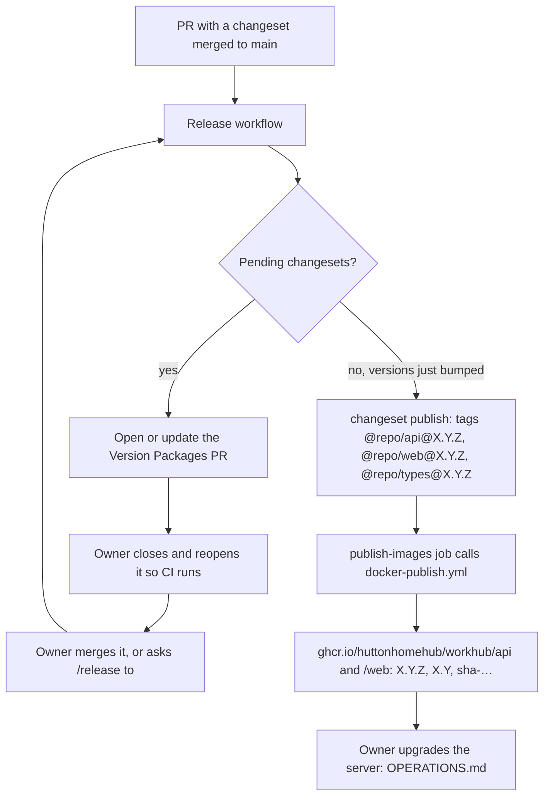

# Releasing

> The canonical home of versioning and releases: changesets, the Version
> Packages PR, the Release workflow, image tags and the pre-release checklist.
> Deploying a release to the server is in [OPERATIONS.md](OPERATIONS.md#routine-upgrade);
> when a release happens is in [PROCESS.md](PROCESS.md#releases).

A release is cut **when the owner wants to deploy**, not on a schedule. Claude
runs it with `/release` only when asked
([`.claude/skills/release/SKILL.md`](../.claude/skills/release/SKILL.md)).

## Changesets

### When to add one

Add a changeset (`pnpm changeset`) **only when the running app changes** — code or
runtime dependencies in `apps/api`, `apps/web` or `packages/types`, including a
migration. Docs, CI, tooling, agents and tests-only changes get none. `/ship`
applies this rule.

Pick the packages the change touches; the `fixed` group (below) bumps all three
together anyway. Choose the bump by what the **owner running the server** has to
do:

| Bump    | When                                                                                                                      | 0.x example     |
| ------- | ------------------------------------------------------------------------------------------------------------------------- | --------------- |
| `patch` | A fix or internal change; the upgrade is the routine runbook                                                              | `0.2.0 → 0.2.1` |
| `minor` | A new capability, or a migration                                                                                          | `0.2.0 → 0.3.0` |
| `major` | The upgrade needs more than the routine runbook — a new required variable, a compose or volume change, a PostgreSQL major | `0.2.0 → 1.0.0` |

Write the summary for the owner reading release notes before an upgrade: what
changed, and anything to do on the server.

### The configuration invariants

[`.changeset/config.json`](../.changeset/config.json) holds two settings that
image publishing depends on. **Don't remove either without changing
`release.yml` and `docker-publish.yml` in the same PR.**

- **`"privatePackages": { "version": true, "tag": true }`** — every workspace
  package is `private`. Without this, Changesets 3 neither versions nor tags
  them: the Version Packages PR never appears, `changeset publish` creates no
  tags, `published` stays `false`, and no images are built.
- **`"fixed": [["@repo/api", "@repo/web", "@repo/types"]]`** — the three
  packages always share one version. The Release workflow reads the version from
  `@repo/api` and tags **both** images with it, and the server runs `api` and
  `web` from one `IMAGE_TAG`. Without `fixed`, a web-only change would release
  `@repo/web@0.3.0` alongside an unchanged `@repo/api` — the workflow would fail
  to find `@repo/api` in the release, or tag images with versions that don't
  match the code in them.

`"changelog": ["@changesets/changelog-github", …]` writes entries with PR,
commit and author links; it needs a GitHub token, so versioning runs in the
workflow, not locally.

### Changelogs

Changesets writes **per-package changelogs**: `apps/api/CHANGELOG.md`,
`apps/web/CHANGELOG.md` and `packages/types/CHANGELOG.md`. Those are the release
notes. It does **not** write the root [`CHANGELOG.md`](../CHANGELOG.md): that
file is the pre-release history of the repository and is not updated by
releases, despite its note.

## The Version Packages PR

On every push to `main`, the [Release workflow](../.github/workflows/release.yml)
runs `changesets/action`. When changesets are pending it runs
`pnpm version-packages` (`changeset version`) and opens or updates a PR titled
**`chore(release): version packages`** on the branch `changeset-release/main`:
package versions bumped, changelog entries written, `.changeset/*.md` consumed.

- It needs the repository setting **Allow GitHub Actions to create and approve
  pull requests** (Settings → Actions → General), which is on.
- **It gets no CI.** The PR is pushed with the built-in `GITHUB_TOKEN`, and
  GitHub starts no workflows from events that token causes. Before merging,
  **close and reopen the PR** (a person reopening it fires `pull_request`), or
  push an empty commit to its branch
  (`git commit --allow-empty -m "chore(release): run ci"`), then wait for green.
  A GitHub App token would remove this step but adds a long-lived secret
  ([TECH_DEBT.md](TECH_DEBT.md)).
- Each later merge to `main` with a changeset updates the same PR; nothing is
  released until it is merged.
- **The owner merges it.** Claude merges it only when asked, through `/release`
  (CLAUDE.md §3).

## What the Release workflow does

When the Version Packages PR is merged, the push to `main` finds no pending
changesets, so the workflow runs `pnpm release` (`changeset publish`):

1. **`release` job** — for private packages, "publish" only creates git tags,
   which the action pushes: `@repo/api@X.Y.Z`, `@repo/web@X.Y.Z` and
   `@repo/types@X.Y.Z`. The job sets `published=true` and resolves the released
   version from `@repo/api` in `published-packages`.
2. **`publish-images` job** — calls
   [`docker-publish.yml`](../.github/workflows/docker-publish.yml) through
   `workflow_call` with that version. It can't rely on the tag push: the tags
   were pushed with `GITHUB_TOKEN`, which starts no workflows.
3. **`docker-publish.yml`** builds `api` and `web` from their Dockerfiles for
   `linux/amd64`, and pushes them to GHCR with an **SBOM** and **build
   provenance** attestation.

Watch it with `gh run watch`; `/release` does.

### Image tags

| Tag           | Example       | Use                                                     |
| ------------- | ------------- | ------------------------------------------------------- |
| `X.Y.Z`       | `0.2.0`       | **Pin this** as `IMAGE_TAG` on the server               |
| `X.Y`         | `0.2`         | Moves with each patch release; not for the server       |
| `sha-<short>` | `sha-2dd559f` | The commit the image was built from; manual builds only |

- No `v` prefix anywhere: git tags are `@repo/<app>@X.Y.Z`, image tags `X.Y.Z`.
- Images are immutable: a release is built once and the same images are run;
  never rebuild a published version with different code.
- Images: `ghcr.io/huttonhomehub/workhub/api` and
  `ghcr.io/huttonhomehub/workhub/web`. Package visibility and host access:
  [OPERATIONS.md](OPERATIONS.md#access-to-the-images-on-ghcr).
- amd64 only today; multi-arch is in PRODUCT.md's [Next](PRODUCT.md#next) list.

### Escape hatches

- **A publish job failed:** re-run the failed jobs of the Release run from the
  Actions tab — it builds from the same commit with the same version.
- **Rebuild one app from its tag:** a tag pushed by a person does trigger
  `docker-publish.yml`, and builds only the app the tag names —
  `@repo/api@X.Y.Z` builds `api`, `@repo/web@X.Y.Z` builds `web`. An existing
  tag must be deleted on GitHub and pushed again to fire the trigger.
- **Manual build** — Actions → _Publish container images_ → Run workflow
  (`workflow_dispatch`) on a branch or tag: both images, tagged `sha-<short>`
  only. For testing an image on a server, never as a release.

## Pre-release checklist

`/release` reports each item before asking the owner to confirm:

- [ ] CI green on `main`.
- [ ] The Version Packages PR has run CI (closed and reopened) and is green.
- [ ] The changelog entries in the PR read correctly for the owner and mention
      anything to do on the server; the bump matches [the table](#when-to-add-one).
- [ ] **Migrations** since the last release reviewed
      (`git diff --stat @repo/api@<last> origin/main -- apps/api/prisma/migrations`);
      destructive or data-transforming ones meet
      [DATABASE.md → Migration safety](DATABASE.md#migration-safety).
- [ ] **Backup plan:** the owner will take a backup before upgrading
      ([OPERATIONS.md](OPERATIONS.md#manual-backup)); required when a migration
      is included.
- [ ] `docker-compose.prod.yml` or `.env.example` changes are called out in the
      changelog.
- [ ] Docs updated; [TECH_DEBT.md](TECH_DEBT.md) and [BACKLOG.md](BACKLOG.md)
      current; no open high-severity CodeQL alerts.

## After the release

Hand over to the server: `IMAGE_TAG=X.Y.Z` and the upgrade runbook in
[OPERATIONS.md → Routine upgrade](OPERATIONS.md#routine-upgrade) — read the
notes, back up, set the tag, pull, `up -d`, check `migrate`, health check.
Rollback is in the same section.
