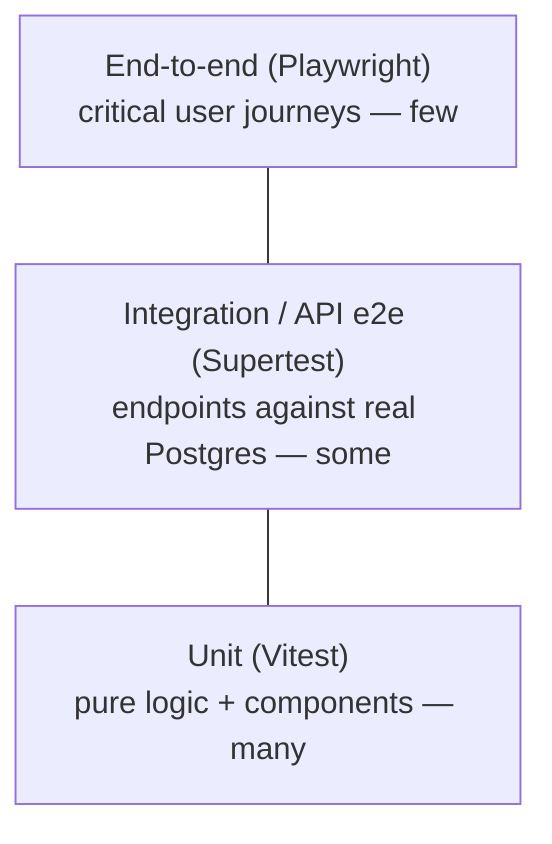

# Testing

> Tests are part of the definition of done. Every feature ships with tests;
> every bug fix ships with a regression test.

## The testing pyramid



Favour many fast unit tests, a solid layer of API integration tests, and a small
number of high-value end-to-end journeys.

## Tooling

| Layer            | Tool                                                   | Location                            |
| ---------------- | ------------------------------------------------------ | ----------------------------------- |
| Unit / component | [Vitest](https://vitest.dev) (+ Testing Library)       | `apps/*/src/**/*.{test,spec}.ts(x)` |
| API integration  | [Supertest](https://github.com/ladjs/supertest) + Nest | `apps/api/test/**/*.e2e-spec.ts`    |
| End-to-end (UI)  | [Playwright](https://playwright.dev)                   | `apps/web/e2e/**`                   |

## Principles

- **Deterministic & isolated.** No shared mutable state, no reliance on real
  time, network, or external services unless explicitly stubbed.
- **Test behaviour, not implementation.** Assert on observable outputs and DOM
  from the user's perspective (Testing Library queries by role/label).
- **Arrange–Act–Assert**, one behaviour per test, descriptive names.
- **Fast feedback.** Unit tests run in milliseconds; keep e2e focused.

## Coverage

- Target **≥ 80% line coverage on changed code**; overall coverage must not
  regress. Coverage is a signal, not a goal — don't write assertion-free tests
  to game it.
- Coverage is collected by Vitest (v8 provider) and reported in CI.

## Backend unit tests

- Test services in isolation with the **repository mocked** (no database): cover
  happy paths and failure modes — ownership denied, not-found, conflict /
  optimistic-lock. Template:
  `apps/api/examples/reference-feature/module/reference.service.spec.ts`.

## Backend integration / API tests

- Boot the **real Nest app** (global pipe, filter, interceptor, guards) and
  exercise endpoints via **Supertest**, asserting status codes and the standard
  `{ data, meta }` / `{ error }` envelopes. Template:
  `apps/api/examples/reference-feature/reference.e2e-spec.ts` (`pnpm gen:feature`
  places it in `apps/api/test/`).
- **Auth seam:** override `AuthContextService` with a test principal (Nest's
  `overrideProvider`) — production auth stays deny-by-default.
- **Database:** run against a **real PostgreSQL** (a disposable instance locally,
  a service container in CI), with migrations applied first (`prisma migrate
deploy`). Each test sets up and tears down its own data; no cross-test
  coupling. Import `AppModule` lazily and **skip when `DATABASE_URL` is unset**
  so the suite stays green without a database and runs fully in CI.

## Frontend testing

- Component tests use Testing Library with the jsdom environment (see
  `apps/web/src/test/setup.ts`).
- Query by accessible role/name to keep tests aligned with accessibility.
- Playwright journeys cover the critical paths and include automated
  accessibility assertions.

## Running tests

```bash
pnpm test           # all unit tests (Turborepo)
pnpm test:e2e       # all end-to-end tests
pnpm --filter @repo/api test         # API unit tests only
pnpm --filter @repo/api test:e2e     # API HTTP e2e (Supertest)
pnpm --filter @repo/web test:watch   # web unit tests in watch mode
bash scripts/verify-template.sh --e2e  # generated feature, incl. its API e2e (needs DATABASE_URL)
```

## CI

[`.github/workflows/ci.yml`](../.github/workflows/ci.yml) runs three jobs; all
must pass before merge:

- **quality** — format, lint, typecheck, unit tests (`pnpm test`), build, the
  API-contract drift check (ADR-0017), and the docs check (`pnpm docs:check`).
- **template** — `scripts/verify-template.sh`: generates a feature from the
  reference template, then type-checks, lints, and unit-tests it.
- **e2e** — a Postgres service with migrations applied, then `pnpm test:e2e`
  (the API Supertest suites and the Playwright journeys on chromium, with axe
  checks) and `scripts/verify-template.sh --e2e` (the generated feature's API
  tests).

## Definition of done (testing)

- [ ] New behaviour has unit tests; endpoints have integration tests
- [ ] Bug fixes include a test that fails without the fix
- [ ] Critical journeys covered by an e2e test where appropriate
- [ ] No skipped/`.only` tests committed
- [ ] Coverage did not regress
